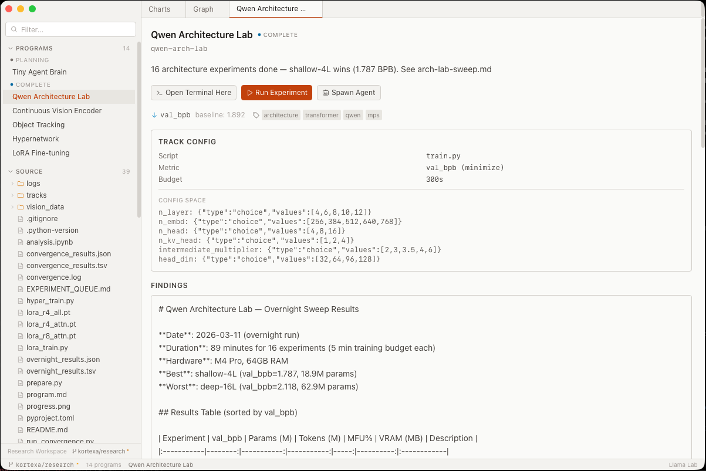
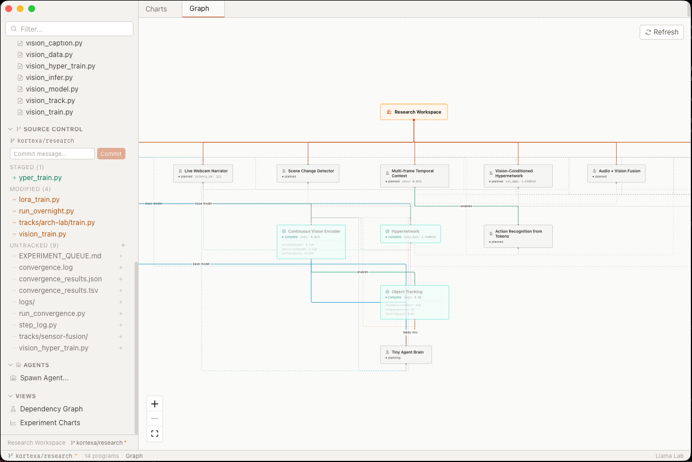
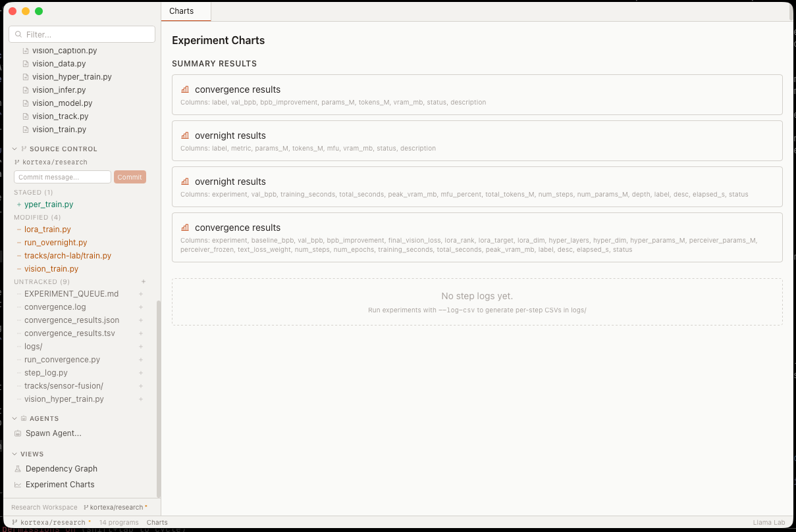

# Llama Lab

A desktop research IDE for running, tracking, and visualizing ML experiments. Built with [Electrobun](https://electrobun.dev) + React + Tailwind.



## What it does

Llama Lab gives you a single place to manage research programs — from experiment code to results to dependency graphs. It's built for the workflow of iterating on ML training scripts: edit code, run experiments, compare results, spawn AI agents to help, repeat.

**Programs & Experiments** — Define research programs with tracks, metrics, and dependencies. View experiment results with sortable tables and metadata.

**Source Tree & Editor** — Browse and edit your codebase directly. Syntax-aware monospace editor with Cmd+S save.

**Git Integration** — Full source control panel: status, staging, diff viewer, commit, push, branch switching. All without leaving the app.



**Dependency Graph** — Interactive node graph showing how research programs relate to each other. Auto-layout with drag-to-rearrange.

**Experiment Charts** — SVG charting for CSV step logs (loss curves, training metrics) and TSV/JSON summary data (bar charts for comparing experiments). Auto-discovers log files and detects schemas from headers.



**Multi-Session Terminal** — Multiple named terminal tabs with full PTY support. Open terminals scoped to specific program directories.

**AI Agent Spawning** — Launch autonomous agents (Claude, Codex, OpenClaw, Hermes) scoped to a research program with contextualized prompts. Agents run in tmux sessions and survive app restarts. Live log tailing.

**Command Palette** — Cmd+P to search programs, files, and commands.

**Workspace Management** — First-run setup wizard, multiple workspaces, recent workspace switching.

## Getting Started

```bash
# Clone
git clone https://github.com/kortexa-ai/llamalab.desktop.git
cd llamalab.desktop

# Install and run (picks the right mode automatically)
./run.sh

# Or explicitly:
./run.sh hmr    # Vite HMR + Electrobun (recommended for dev)
./run.sh dev    # Vite build + Electrobun watch (no HMR)
./run.sh build  # Production build
./run.sh clean  # Nuke caches
```

Requires [Bun](https://bun.sh) and [Electrobun](https://electrobun.dev).

On first launch, a setup wizard will guide you through configuring your workspace and connecting a source code repository.

## Architecture

```
src/
  bun/                  # Backend (runs in Bun/Electrobun main process)
    index.ts            # Entry point, RPC wiring, window/menu setup
    config.ts           # Centralized workspace config (single source of truth for paths)
    research.ts         # Program/track/results data layer (filesystem reads)
    git.ts              # Git CLI wrapper (status, diff, commit, push, branches)
    charts.ts           # Experiment log discovery, CSV/TSV/JSON parsing
    agents.ts           # AI agent spawn/list/kill via tmux
    prompt-builder.ts   # Contextualized prompt generation for agents
    terminal.ts         # PTY session manager (Python wrapper)
    workspace.ts        # Workspace CRUD, setup wizard backend
    preferences.ts      # App preferences (~/.config/llamalab/)
  mainview/             # Frontend (React, renders in Electrobun webview)
    App.tsx             # Root layout, setup wizard gate
    hooks/
      useWorkspace.tsx  # Global state (React context + reducer)
    components/
      Sidebar.tsx       # Programs, source tree, source control, agents
      ContentPane.tsx   # Tab content router
      ProgramOverview.tsx
      GraphView.tsx     # Interactive dependency graph (@xyflow/react)
      ChartView.tsx     # SVG line/bar charts + charts browser
      FileEditor.tsx    # Code editor with save
      DiffViewer.tsx    # Unified diff with color
      TerminalPanel.tsx # Multi-session terminal (@xterm/xterm)
      CommandPalette.tsx
      SetupWizard.tsx   # First-run / new workspace wizard
      ...
    rpc.ts              # Electroview RPC setup, event bridging
  shared/
    types.ts            # All RPC types, data interfaces
```

Communication between backend and frontend uses Electrobun's typed RPC system. The full schema lives in `src/shared/types.ts`.

## Tech Stack

- **Runtime**: [Bun](https://bun.sh) + [Electrobun](https://electrobun.dev) (macOS native, no Electron)
- **Frontend**: React 18, Tailwind CSS, TypeScript
- **Graph**: [@xyflow/react](https://reactflow.dev)
- **Terminal**: [@xterm/xterm](https://xtermjs.org) + Python PTY wrapper
- **Icons**: [@phosphor-icons/react](https://phosphoricons.com)
- **Charts**: Pure SVG (no charting library)
- **Build**: Vite (HMR in dev)

## Contributing

See [CONTRIBUTING.md](CONTRIBUTING.md). Issues and PRs welcome.

## License

MIT
